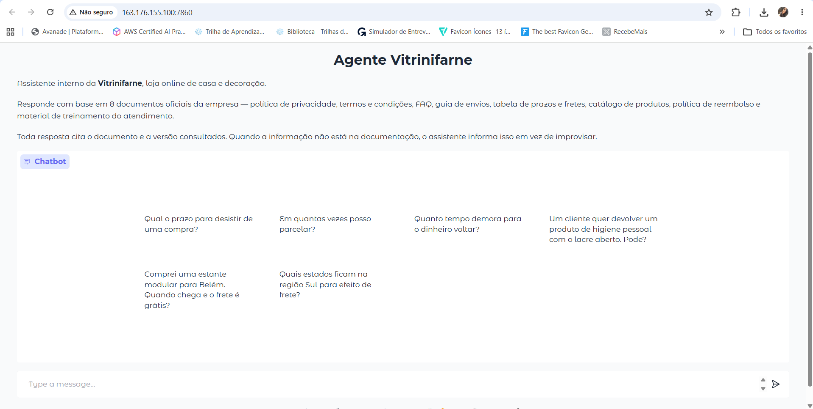
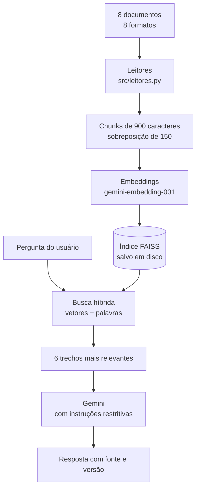
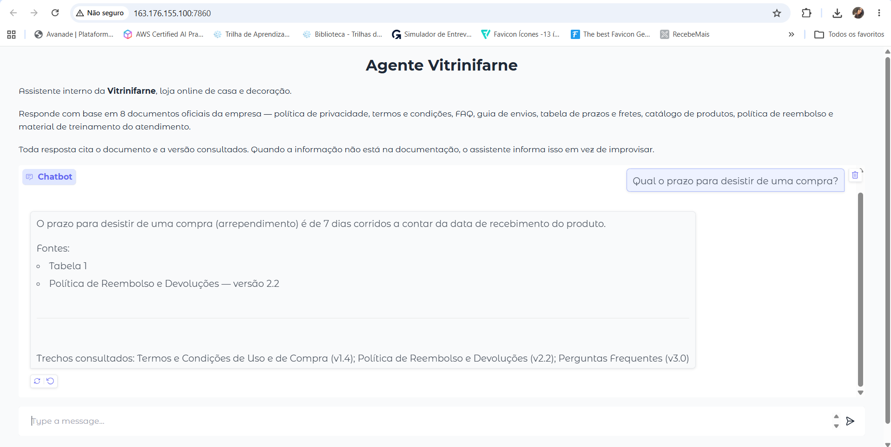
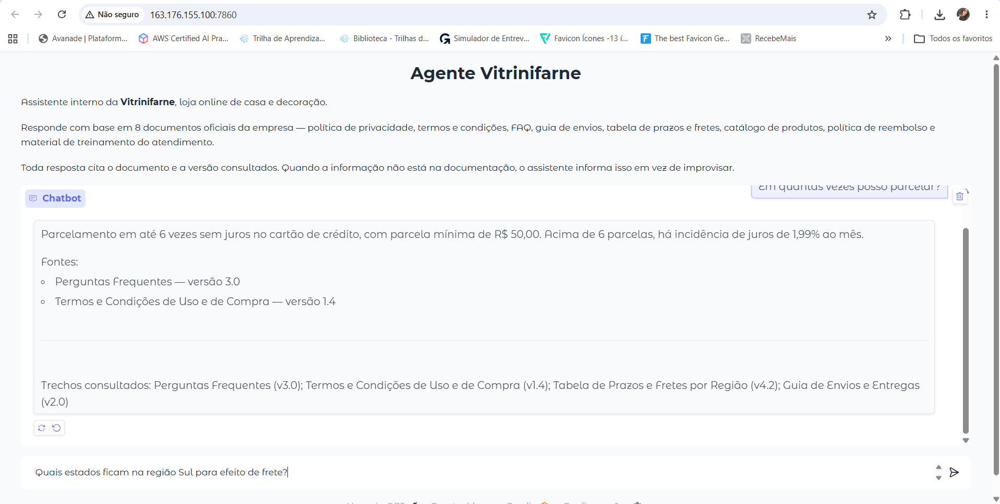
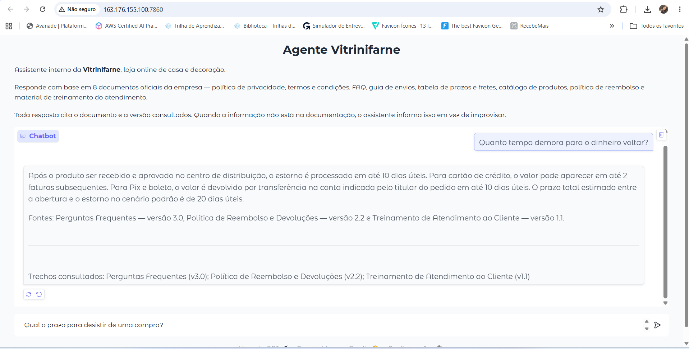
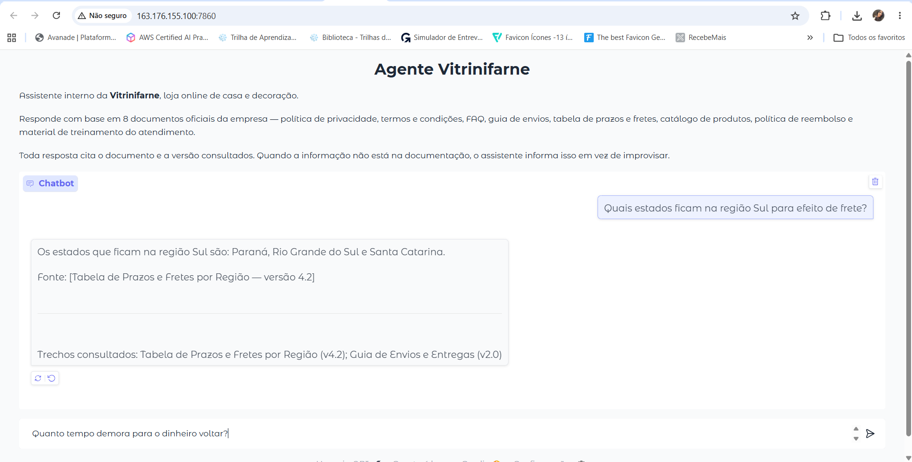
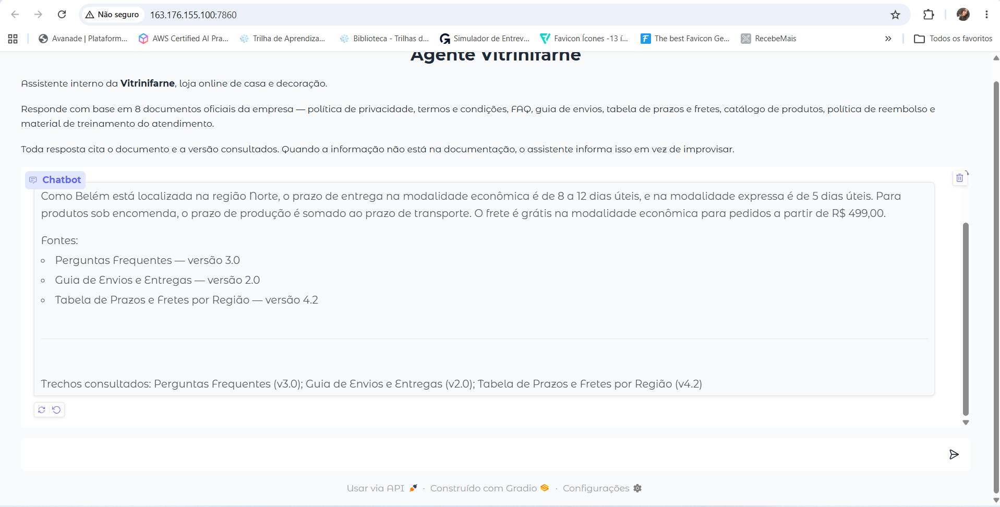
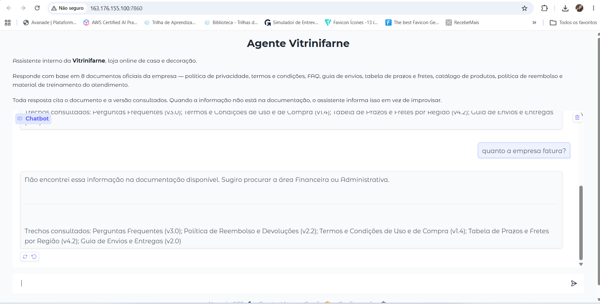
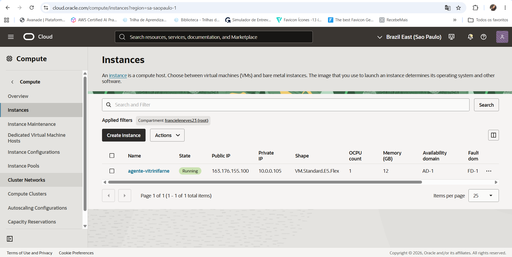

# Agente Vitrinifarne

Agente de inteligência artificial que responde perguntas sobre a documentação interna de
uma loja online de casa e decoração. Lê oito documentos em oito formatos diferentes,
busca o trecho relevante e responde em linguagem natural, sempre citando o documento e a
versão consultados.

Projeto desenvolvido como desafio final do curso de Agentes de IA da Alura, com
implantação na Oracle Cloud Infrastructure.

**Aplicação no ar:** http://163.176.155.100:7860



---

## O problema

Documentação corporativa fica espalhada em formatos incompatíveis: o jurídico escreve em
Word, a logística mantém planilhas, o marketing publica em HTML, o sistema exporta CSV e
JSON. Quem precisa de uma resposta rápida acaba perguntando para um colega, e a resposta
depende de quem foi perguntado.

O agente centraliza isso: uma pergunta em português, uma resposta baseada no documento
oficial, com a fonte identificada.

## A base de conhecimento

A Vitrinifarne é uma loja fictícia criada para o projeto. A documentação cobre cinco
domínios organizacionais e usa um formato de arquivo diferente para cada documento.

| Documento | Formato | Domínio | Versão |
|---|---|---|---|
| Política de Privacidade | PDF | Jurídico / LGPD | 2.1 |
| Termos e Condições de Uso e de Compra | DOCX | Jurídico / Contratual | 1.4 |
| Perguntas Frequentes | Markdown | Atendimento | 3.0 |
| Guia de Envios e Entregas | HTML | Operacional / Logística | 2.0 |
| Tabela de Prazos e Fretes por Região | XLSX | Operacional / Logística | 4.2 |
| Catálogo de Produtos | CSV | Comercial / Produto | 12.7 |
| Política de Reembolso e Devoluções | JSON | Pós-venda / Financeiro | 2.2 |
| Treinamento de Atendimento ao Cliente | PPTX | Recursos Humanos | 1.1 |

Os documentos são consistentes entre si de propósito: o prazo de arrependimento no FAQ é
o mesmo do JSON e dos Termos; os prazos da planilha batem com os do guia HTML. Isso
permite testar se o agente cruza fontes sem se contradizer.

Um nono arquivo, o `manifesto.json`, funciona como inventário: informa quais documentos
existem, formato, categoria, versão e área responsável. É dele que vêm os metadados
usados na citação das fontes.

## Arquitetura



A indexação roda uma vez e é salva em disco. A consulta roda a cada pergunta.

### Decisões técnicas

**Dados tabelados viram frases.** Planilha, CSV e JSON não são despejados como texto
bruto. Cada linha é convertida em frase com o nome da coluna junto do valor:

```
Região: Norte; Prazo econômico mín. (dias): 8; Frete grátis a partir de (R$): 499
```

Sem isso, a linha `Norte 8 12 5 39.9 499` não contém as palavras "prazo" nem "frete", e a
busca por similaridade nunca a encontraria.

**Busca híbrida.** A busca por vetores entende sinônimos — encontra "estorno" quando a
pergunta fala em "dinheiro de volta". Mas falha com nomes próprios pouco frequentes, como
o nome de um produto do catálogo. O agente combina as duas estratégias: recupera por
similaridade vetorial e também qualquer trecho que contenha duas ou mais palavras da
pergunta, reordenando pelo conjunto.

**Índice persistido.** Gerar os embeddings custa tempo e cota de API. O índice é gravado
em `indice/` na primeira execução e carregado do disco nas seguintes, o que faz o
servidor reiniciar em menos de um segundo.

**Recusa explícita.** As instruções do modelo proíbem responder fora dos trechos
recuperados. Quando a informação não está na documentação, o agente informa isso e sugere
a área a procurar, em vez de improvisar uma resposta plausível.

**Modelos configuráveis por variável de ambiente.** `MODELO_CHAT` e `MODELO_EMBEDDING`
podem ser trocados sem alterar código, o que permite contornar limites de cota do plano
gratuito do Gemini.

## Estrutura do repositório

```
vitrinifarne-agente/
├── docs/                          base de conhecimento (8 documentos + manifesto)
├── src/
│   ├── leitores.py                um leitor por formato de arquivo
│   └── agente.py                  indexação, busca híbrida e geração de resposta
├── notebooks/
│   ├── 01_leitura_documentos.ipynb    extração dos 8 formatos
│   ├── 02_indice_e_agente.ipynb       chunking, embeddings, índice e respostas
│   └── 03_interface_gradio.ipynb      teste da interface web
├── app.py                         interface web com Gradio
├── requirements.txt               dependências
└── README.md
```

## Tecnologias

| Camada | Escolha |
|---|---|
| Linguagem | Python 3 |
| Leitura de documentos | pypdf, python-docx, python-pptx, openpyxl, BeautifulSoup, pandas |
| Divisão em chunks | LangChain (`RecursiveCharacterTextSplitter`) |
| Embeddings e geração | Google Gemini via `langchain-google-genai` |
| Busca vetorial | FAISS (`IndexFlatIP` com vetores normalizados) |
| Interface | Gradio |
| Implantação | Oracle Cloud Infrastructure — Compute |

## Perguntas que o agente responde

A base cobre cinco domínios organizacionais. Exemplos de perguntas atendidas em cada um:

**Jurídico e privacidade**
- Quais dados pessoais a loja coleta e com que finalidade?
- Por quanto tempo os dados de um cliente ficam armazenados?
- Como peço a exclusão dos meus dados?
- Qual o foro eleito nos termos de uso?

**Logística e entrega**
- Qual o prazo de entrega expresso para o interior do Nordeste?
- A partir de quanto o frete fica grátis?
- Quantas tentativas de entrega a transportadora faz?
- Quais estados ficam na região Sul para efeito de frete?

**Pós-venda e financeiro**
- Qual o prazo para desistir de uma compra?
- Quanto tempo demora para o dinheiro voltar?
- Quem paga o frete de uma devolução por defeito?
- Que produtos não podem ser devolvidos por arrependimento?

**Comercial e catálogo**
- Quanto custa a estante modular e ela é pronta entrega?
- Quais produtos são vendidos sob encomenda?
- Qual a garantia dos itens de mobiliário?

**Atendimento e treinamento interno**
- Qual o prazo de primeira resposta no WhatsApp?
- Quando um atendente deve escalonar um caso para a coordenação?
- Em quantas vezes posso parcelar e qual a parcela mínima?

Perguntas que cruzam mais de um documento também são atendidas — o exemplo da estante
para Belém, mais adiante, combina catálogo, tabela de prazos e guia de entregas.

## Exemplos de respostas geradas

Todas as capturas abaixo foram feitas na aplicação em execução na Oracle Cloud.

### Perguntas diretas

**Qual o prazo para desistir de uma compra?**

> O prazo para desistir de uma compra (arrependimento) é de 7 dias corridos a contar da
> data de recebimento do produto.
>
> Fonte: Política de Reembolso e Devoluções — versão 2.2



**Em quantas vezes posso parcelar?**

> Parcelamento em até 6 vezes sem juros no cartão de crédito, com parcela mínima de
> R$ 50,00. Acima de 6 parcelas, há incidência de juros de 1,99% ao mês.
>
> Fontes: Perguntas Frequentes — versão 3.0; Termos e Condições de Uso e de Compra —
> versão 1.4



### Pergunta com vocabulário diferente do documento

**Quanto tempo demora para o dinheiro voltar?**

Em nenhum documento aparece a expressão "dinheiro voltar" — o termo usado é "estorno".
A busca por similaridade semântica encontra o trecho certo mesmo sem coincidência de
palavras.

> Após o produto ser recebido e aprovado no centro de distribuição, o estorno é
> processado em até 10 dias úteis. Para cartão de crédito, o valor pode aparecer em até
> 2 faturas subsequentes. Para Pix e boleto, o valor é devolvido por transferência na
> conta indicada pelo titular do pedido em até 10 dias úteis. O prazo total estimado
> entre a abertura e o estorno no cenário padrão é de 20 dias úteis.
>
> Fontes: Perguntas Frequentes — versão 3.0; Política de Reembolso e Devoluções —
> versão 2.2; Treinamento de Atendimento ao Cliente — versão 1.1



### Consulta a dados tabelados

**Quais estados ficam na região Sul para efeito de frete?**

A resposta vem de uma planilha Excel, convertida em frases durante o processamento.

> Os estados que ficam na região Sul são: Paraná, Rio Grande do Sul e Santa Catarina.
>
> Fonte: Tabela de Prazos e Fretes por Região — versão 4.2



### Pergunta que exige cruzar documentos

**Comprei uma estante modular para Belém. Quando chega e o frete é grátis?**

Nenhum documento responde sozinho. É preciso relacionar a cidade à região (planilha de
prazos), a região ao prazo de entrega (guia de envios) e ao valor mínimo de frete grátis,
que no Norte é diferente do restante do país.

> Como Belém está localizada na região Norte, o prazo de entrega na modalidade econômica
> é de 8 a 12 dias úteis, e na modalidade expressa é de 5 dias úteis. Para produtos sob
> encomenda, o prazo de produção é somado ao prazo de transporte. O frete é grátis na
> modalidade econômica para pedidos a partir de R$ 499,00.
>
> Fontes: Perguntas Frequentes — versão 3.0; Guia de Envios e Entregas — versão 2.0;
> Tabela de Prazos e Fretes por Região — versão 4.2



### Pergunta fora da base de conhecimento

**Quanto a empresa fatura?**

A informação não existe na documentação. O agente recusa em vez de improvisar uma
resposta plausível.

> Não encontrei essa informação na documentação disponível. Sugiro procurar a área
> Financeira ou Administrativa.



## Como executar

### Requisitos

- Python 3.10 ou superior
- Chave de API do Google Gemini, obtida em [Google AI Studio](https://aistudio.google.com)

### Local

```bash
git clone https://github.com/francielleneves/vitrinifarne-agente.git
cd vitrinifarne-agente

pip install -r requirements.txt

export GOOGLE_API_KEY="sua-chave-aqui"
python app.py
```

A aplicação sobe em `http://localhost:7860`. Na primeira execução, o agente lê os
documentos e gera o índice, o que leva cerca de um minuto. Nas seguintes, carrega o
índice do disco.

### Google Colab

Os notebooks da pasta `notebooks/` rodam diretamente no Colab. A chave de API deve ser
cadastrada nos Secrets com o nome `GOOGLE_API_KEY`. Comece pelo `01`, que trata da
leitura dos documentos, e siga a numeração.

### Oracle Cloud Infrastructure

A aplicação roda em uma instância de Compute na região Brazil East (São Paulo).

**Infraestrutura provisionada**

| Recurso | Configuração |
|---|---|
| Instância | VM.Standard.E5.Flex — 1 OCPU, 12 GB |
| Sistema operacional | Canonical Ubuntu 24.04 |
| Rede | VCN com sub-rede pública e internet gateway |
| Portas liberadas | 22 (SSH) e 7860 (aplicação) |

**1. Conectar na instância**

```bash
ssh -i ssh-key.key ubuntu@163.176.155.100
```

**2. Instalar dependências e clonar o projeto**

```bash
sudo apt update && sudo apt install -y python3-pip python3-venv git
git clone https://github.com/francielleneves/vitrinifarne-agente.git
cd vitrinifarne-agente
python3 -m venv .venv
source .venv/bin/activate
pip install -r requirements.txt
```

**3. Liberar a porta 7860**

A porta precisa ser aberta em dois lugares independentes. Na Oracle Cloud, uma regra de
ingresso na lista de segurança da sub-rede pública (origem `0.0.0.0/0`, TCP, porta de
destino 7860). E dentro do Ubuntu, no iptables — inserindo a regra **antes** do REJECT
padrão, caso contrário ela não tem efeito:

```bash
sudo iptables -I INPUT 5 -p tcp --dport 7860 -j ACCEPT
sudo netfilter-persistent save
```

**4. Configurar a chave de API**

A chave fica em um arquivo de ambiente com permissão restrita, fora do repositório:

```bash
sudo bash -c 'echo "GOOGLE_API_KEY=sua-chave" > /etc/vitrinifarne.env'
sudo bash -c 'echo "MODELO_CHAT=gemini-flash-lite-latest" >> /etc/vitrinifarne.env'
sudo chmod 600 /etc/vitrinifarne.env
```

**5. Executar como serviço**

A aplicação roda sob o systemd, com reinício automático em caso de falha e inicialização
junto com a máquina:

```bash
sudo systemctl daemon-reload
sudo systemctl enable --now vitrinifarne
sudo systemctl status vitrinifarne
```

O arquivo de serviço está em `deploy/vitrinifarne.service`.



## Limitações conhecidas

- O plano gratuito do Gemini limita as requisições diárias por modelo. Em caso de bloqueio
  por cota, troque o modelo pela variável de ambiente `MODELO_CHAT`.
- O agente não mantém memória entre perguntas: cada pergunta é respondida isoladamente.
- A base é estática. Alterar um documento exige regerar o índice, o que é feito apagando a
  pasta `indice/` e reiniciando a aplicação.

## Autoria

Desenvolvido por Francielle Neves como desafio final do curso de Agentes de IA da Alura.
